[日本語](#sets-n-reps-日本語) | [English](#sets-n-reps-english)

# [Sets-n-Reps](https://sets-n-reps.com) (日本語)

Sets-n-Repsは、デスクトップとモバイルの両方に対応したブラウザベースのトレーニング記録アプリです。

<p style="display: flex; justify-content: center; align-items: center; gap: 10px;">  
    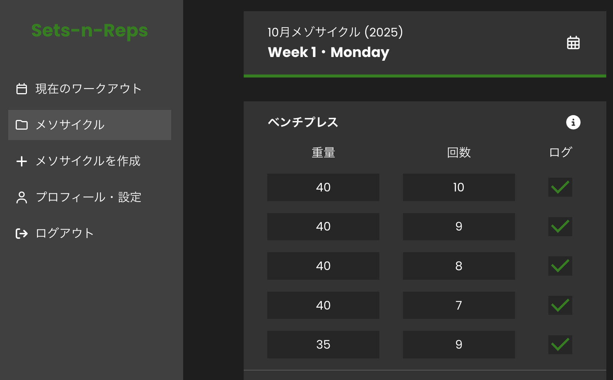
    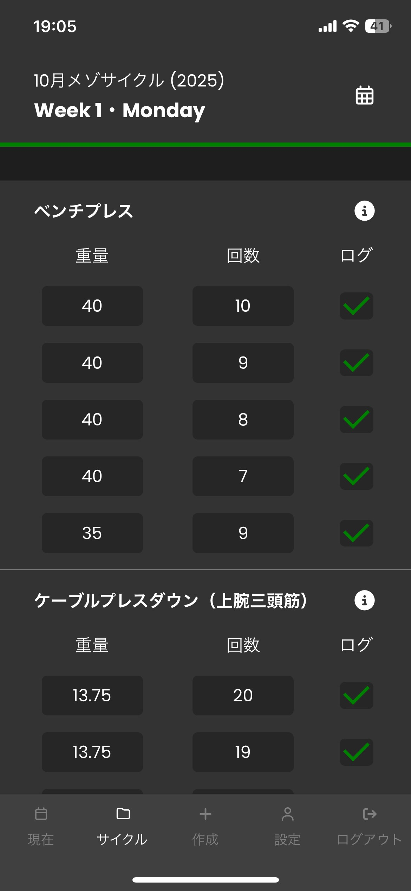
</p>

このアプリには3つの主な機能があります：

**(1) メゾサイクル（トレーニングプログラム）の作成**
- お好みのメゾサイクルを作成（4〜8週間）。各週は自動的に目標RIRを反映します。

**(2) トレーニングデータの記録**
- ドロップダウンメニューからワークアウト（1日分のトレーニングセッション）を選択し、データ（重量、反復回数、完了ステータス）を記録します。

**(3) 過去トレーニングデータの即時表示**
- 過去のメゾサイクルやワークアウトにおけるパフォーマンスを素早く確認できます。<br><br/>
<p align="center">・・・</p>

📌 メゾサイクル
- 数週間から数か月単位でトレーニングの計画を組み立てる周期のこと。

📌 RIR
- 「Repetitions in Reserve」の略。
- 「予備の反復回数」を意味し、「あと何回できるか？」を基準にトレーニング強度を調整する指標。
<br><br/>

## 目次

- [(1) 使用技術](#使用技術)
- [(2) 機能概要](#機能概要)
<!--
- [(3) 技術概要](#技術概要)
- [(4) 開発の理由](#why-build-this)
- [(5) 開発上の課題](#challenges)
- [(6) 成果](#accomplishments)
- [(7) 改善点](#improvements-needed)
- [(8) 最後に](#finishing-notes)
-->

## 使用技術

- **フロントエンド:** [TypeScript](https://www.typescriptlang.org/) ・ [React](https://react.dev/)
- **バックエンド:** [Ruby](https://www.ruby-lang.org/en/) ・ [Ruby on Rails](https://rubyonrails.org/)
- **スタイリング:** [CSS Modules](https://github.com/css-modules/css-modules)
- **データベース:** [PostgreSQL](https://www.postgresql.org/)
- **ホスティング:** [Vultr VPS](https://www.vultr.com/)

## 機能概要

#### (1) メゾサイクル（トレーニングプログラム）の作成
- お好みのトレーニング部位を入力し、4〜8週間の期間を設定してメゾサイクルを作成：
  <!-- - ※ 各トレーニング部位には、デフォルトで５セット割り当てられる。-->
  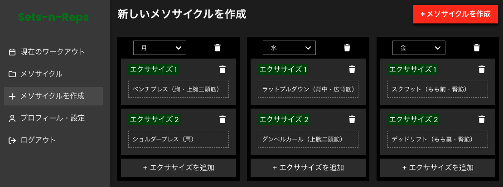
  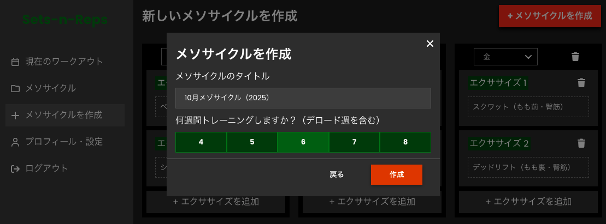
- メゾサイクル（トレーニングプログラム）作成完了後：

  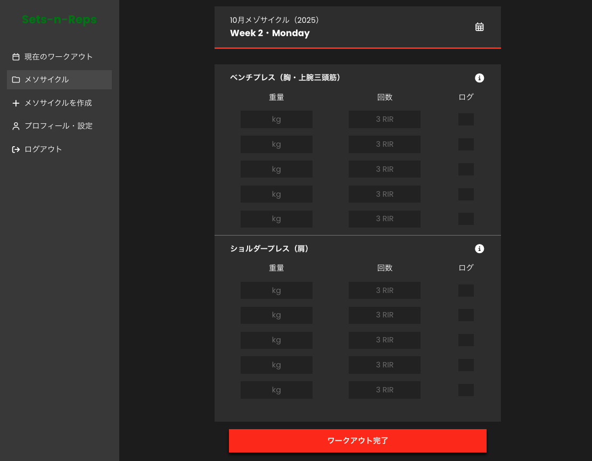

#### (2) ワークアウト（1日分のトレーニングセッション）の記録
- ドロップダウンメニューからワークアウトを選択。メニュー内のボタン色で完了ステータスの確認が可能：
  - 完了済みワークアウト（🟢）
  - 進行中のワークアウト（🔴）
  - 未完了のワークアウト（色なし）
- RIRの自動割当:
  - ４週間メゾサイクルの場合：
    - Week 1 → RIR 2
    - Week 2 → RIR 1
    - Week 3 → RIR 0
    - Week 4 → 最後の週は休養週
  - ６週間メゾサイクルの場合：
    - Week 1 → RIR 4
    - Week 2 → RIR 3
    - Week 3 → RIR 2
    - Week 4 → RIR 1
    - Week 5 → RIR 0
    - Week 6 → 最後の週は休養週
    
- ドロップダウンメニュー：

  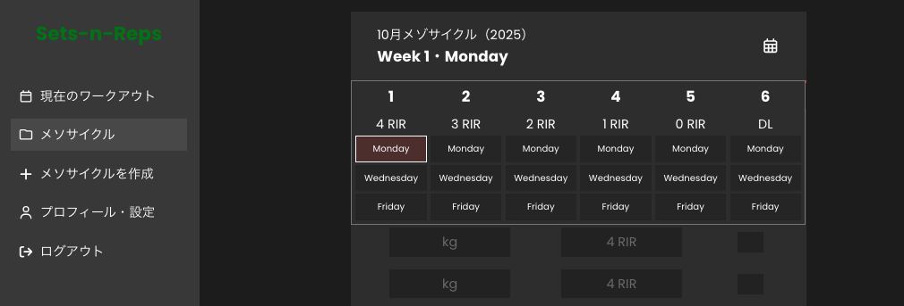

- トレーニングが進行するにつれて次のように表示：

  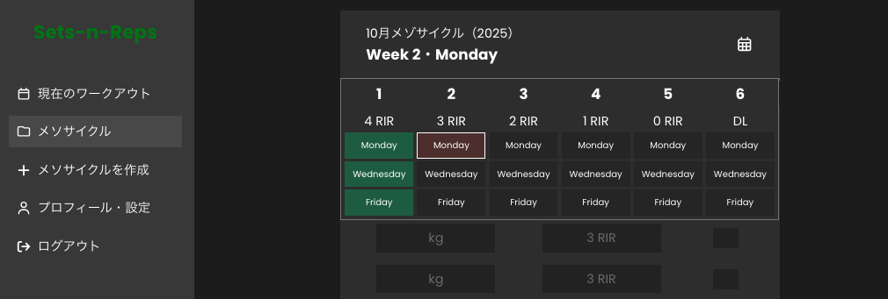

- トレーニングデータの記録：
  - 重量（例：40kg）
  - 反復回数（例：10回）
  - 反復セットの完了状況（例：✅）
- 重量自動入力機能
    - 重量を入力すると、残りのセットにも同じ値を自動入力
    - 設定ページにて無効化可能

- トレーニングデータの記録（ジムでのモバイル使用例）：
  <p style="display: flex; gap: 5px; justify-content: center;">
    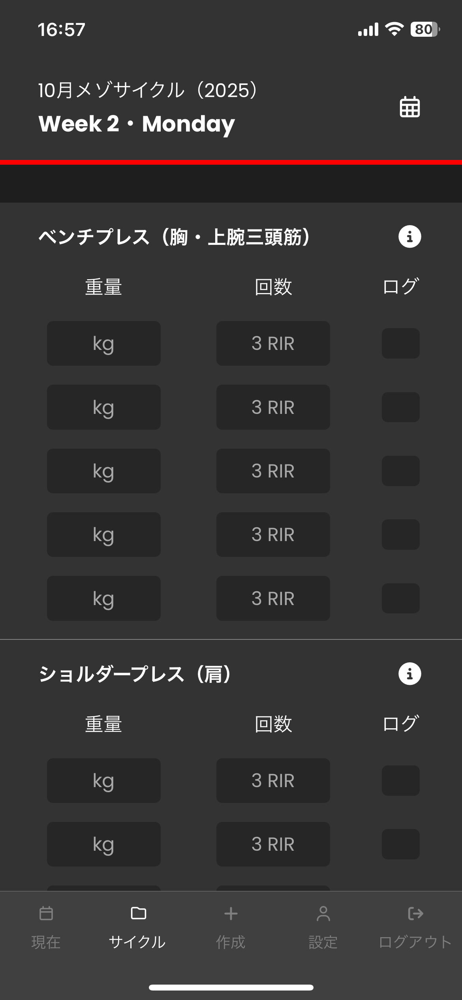
    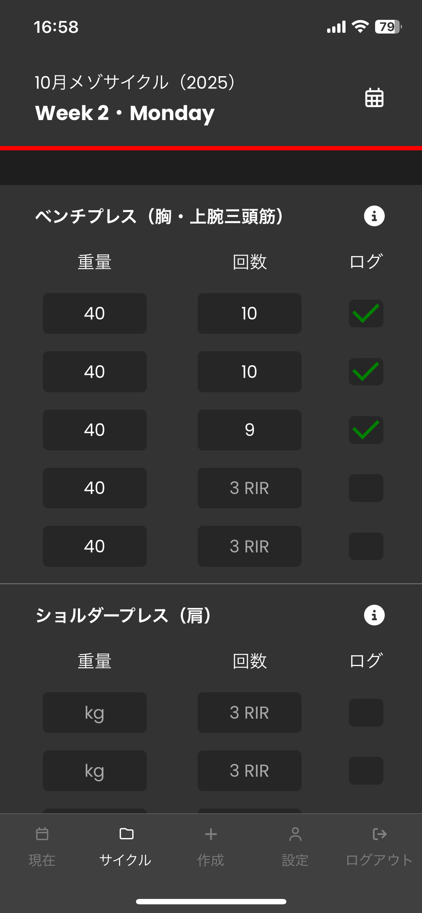
    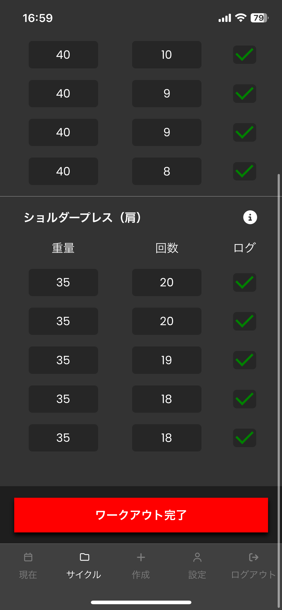
  </p>

- トレーニング完了後は、ステータスを更新：

  <p style="display: flex; gap: 5px;">
    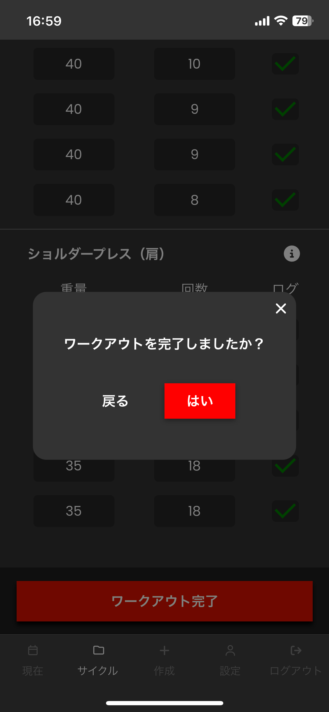
    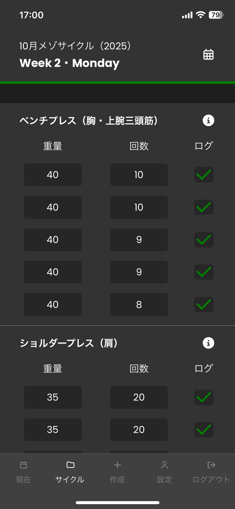
  </p>

#### (3) 過去パフォーマンスの振り返り
- 「ⓘ」アイコンを押すと表示されるダイアログで、過去のパフォーマンスデータを比較・確認
  - 使用した重量
  - 実施した反復回数
  - その他詳細（メゾサイクル名・週番号）

- 使用例（３週目だとして）：
  <p style="display: flex; gap: 5px;">
    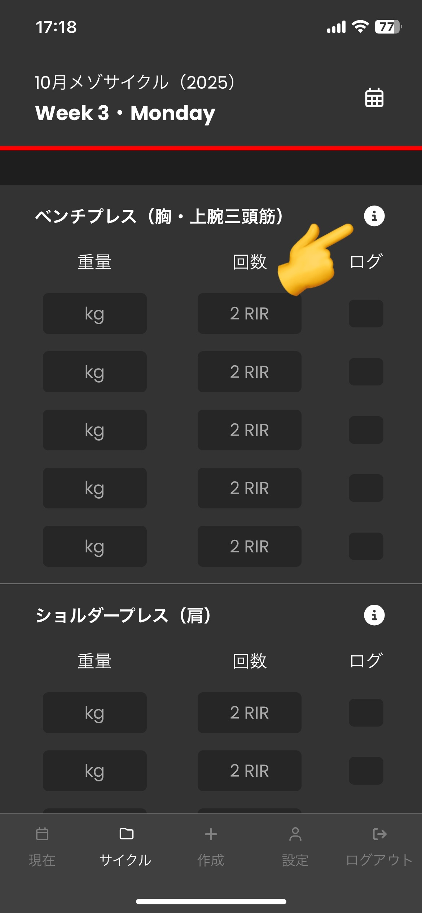
    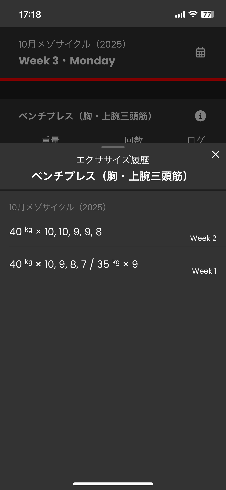
  </p>

# [Sets-n-Reps](https://sets-n-reps.com) (English)                                                                

Sets-n-Reps is a browser-based workout tracker designed for both desktop and mobile.

<p style="display: flex;">
    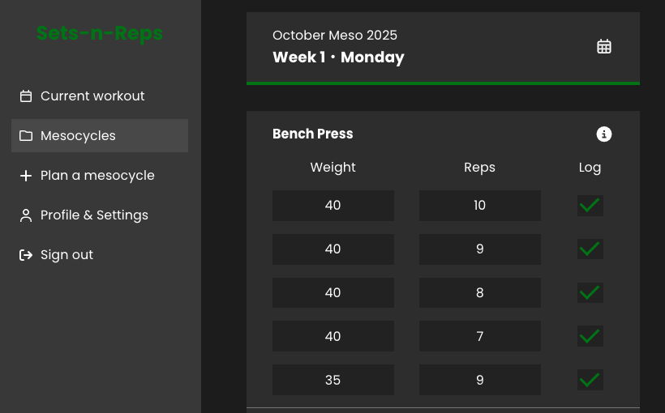
    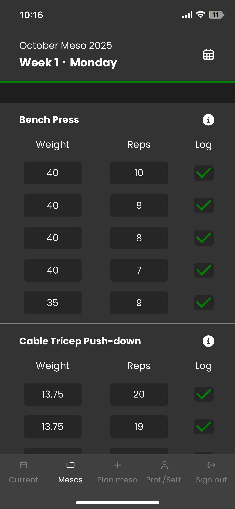
</p>

It offers three key features:

**(1) Mesocycle Creation ([demo](https://www.youtube.com/watch?v=a8TEfTkuYi0&t=32s))**
- Build [mesocycles](https://hevycoach.com/glossary/mesocycle/) of your choice (between 4-8 weeks), <br/>with each week automatically reflecting its target RIRs ([Reps in Reserve](https://rpstrength.com/blogs/video-guides/how-to-estimate-reps-in-reserve-for-muscle-growth?srsltid=AfmBOopJY6eLMhTDjRUhlJBqIOhVTBMk8ebFSj5RpzcKdDZINWDI-gFl#:~:text=Getting%20stronger%20isn%E2%80%99t%20just%20about%20moving%20more%20weight%E2%80%94it%E2%80%99s%20about%20knowing%20when%20to%20stop.%20One%20of%20the%20most%20effective%20strategies%20for%20growth%20without%20burning%20out%20is%20using%20Reps%20In%20Reserve%20(RIR).
)).

**(2) Workout tracking ([demo](https://www.youtube.com/watch?v=a8TEfTkuYi0&t=4m11s))**
- Choose a workout from the drop-down menu and log your data (weight, reps, and completion status).

**(3) Exercise history look-back ([demo](https://www.youtube.com/watch?v=a8TEfTkuYi0&t=5m32s))**
- Quickly review past performance for any exercise across previous workouts or mesocycles.

## Table of Contents

- [(1) Technologies](#technologies)
- [(2) Full demo](#full-demo)
- [(3) Features](#features)
- [(4) Technical overview](#technical-overview)
- [(5) Why build this?](#why-build-this)
- [(6) Installation](#installation)
- [(7) Challenges](#challenges)
- [(8) Accomplishments](#accomplishments)
- [(9) Improvements needed](#improvements-needed)
- [(10) Finishing notes](#finishing-notes)

## Technologies

- [TypeScript](https://www.typescriptlang.org/) & [React](https://react.dev/) for the frontend
- [Ruby](https://www.ruby-lang.org/en/) & [Ruby on Rails](https://rubyonrails.org/) for the backend
- [CSS Modules](https://github.com/css-modules/css-modules) for styles
- [PostgreSQL](https://www.postgresql.org/) for the DB
- [Vultr VPS](https://www.vultr.com/) for hosting

## Full Demo
[▶ Watch the full demo on YouTube](https://www.youtube.com/watch?v=a8TEfTkuYi0)

[](https://www.youtube.com/watch?v=a8TEfTkuYi0)


## Features

#### (1) Mesocycle Creation
- Create customized mesocycles ranging from 4-8 weeks
- Automatic RIR (Reps in Reserve) progression system:
  - Starts at an RIR based on mesocycle length (e.g., 4-week mesocycle starts at 2 RIR)
  - Progressively decreases RIR each week until the deload week
  - Final week is automatically set as a deload week (0 RIR)
- Each exercise contains 5 sets by default
#### (2) Workout Tracking
- Workout picker drop-down with visual status indicators:
  - Completed workouts (green)
  - Currently active workouts (red)
  - Uncompleted workouts (uncolored)
- Track key metrics for each set:
  - Weight (e.g. 12kg)
  - Reps (e.g. 20 reps)
  - Set completion status (e.g. ✅)
- Weight auto-fill feature (optional):
    - Entering a weight automatically fills subsequent sets with the same value
    - Can be disabled in settings page
#### (3) Exercise history look-back
- View and compare performance with previous workouts or mesocycles via a dialog showing:
  - Weights used
  - Reps performed
  - When it was performed (mesocycle name & week #)

## Technical Overview

#### Frontend architecture
- TypeScript for type safety
- React for component-based architecture
- RESTful requests (GET, POST, PATCH, DELETE) from the front-end
- Sends httpOnly cookies along with requests by setting `credentials: "include"`
    - Prevents JavaScript from reading the cookie, XSS attack risks
- Hooks (built-in):
  - `useState` for component state
  - `useEffect` for data fetching & side effects
  - `useNavigate` for navigation
  - `useTranslation` for internationalization
  - `useContext` for global state
- Hooks (custom):
  - `useAuth` for authentication state management
- Scoped styling with CSS modules
- Responsive design for mobile devices
- Internationalization with i18n library
- .env file for environment variables
- Icons with Font Awesome icons

#### Backend architecture
- Ruby on Rails API backend
- RESTful API design with namespaced endpoints using `/api/`
- Auto-save with immediate PATCH requests on input
- PostgreSQL database with table relationships:
  - `users → mesocycles → workouts → exercises → exercise_sets`
  - *Some relationships are not strictly linear:
    - `users -> workouts`
    - `users → mesocycles` via `active_meso_id` (custom foreign key in 'users' table, for tracking a user's 'active' mesocycle)
- Nested attributes for updating multiple table records at once

#### Authentication & Security
- Devise for user authentication
- dotenv-rails for environment variables
- Rate limiting with rack-attack gem's `throttle()`:
  - 10 sign-in attempts per 20 seconds
  - 5 sign-up attempts per 60 seconds
  - 300 read operations per 5 minutes
  - 300 write operations per 5 minutes
- Configured CORS (Cross-Origin Resource Sharing) to:
  - Allow frontend to access API
  - Block requests from unauthorized domains
  - Enable sending of httpOnly cookies from the front-end with `credentails: true`

## Why build this?

Primarily for two reasons (in no specific order):
- I was looking to build something with this tech stack to showcase my skills with (TypeScript, React, Ruby on Rails, PostgreSQL).
- I was paying for a workout tracking web app already called the [Renaissance Periodization Hypertrophy App](https://rpstrength.com/pages/hypertrophy-app?srsltid=AfmBOooWVKvGu1J6YMuF_yhh4uo00Z_EgGPeXhZcRtGT-SJs-Kp4eMIt). It's an amazing app but I don't use all of its features and I didn't want to keep paying for it (and I nolonger do thanks to Sets-n-Reps!).

[In the link](https://rpstrength.com/pages/hypertrophy-app?srsltid=AfmBOooWVKvGu1J6YMuF_yhh4uo00Z_EgGPeXhZcRtGT-SJs-Kp4eMIt) you might notice that the functionality and the design are very similar. And they are. I essentially picked from it the parts I liked, left the parts that I had no use for, and made my own. It's for this reason that I decided to go with the MIT license, and I have no plans on putting a subscriptions page on it.


## Installation
First, ensure you have these installed:
- [Homebrew](https://brew.sh/)
- [rbenv](https://github.com/rbenv/rbenv) for Ruby version management
- [PostgreSQL](https://www.postgresql.org/) (`brew install postgresql@14`)
- [Yarn](https://yarnpkg.com/) (`npm install -g yarn`)

#### Then:
1. Clone the repository
   ```bash
   git clone https://github.com/lyuhiroyama/sets-n-reps.git
   cd sets-n-reps
   ```

2. Install Ruby 3.4.2
   ```bash
   # Install Ruby
   rbenv install 3.4.2
   rbenv local 3.4.2

   # If 'ruby' command still points to another ruby version, do:
   # (for bash):
   echo 'export PATH="$HOME/.rbenv/bin:$PATH"' >> ~/.bashrc
   echo 'eval "$(rbenv init - bash)"' >> ~/.bashrc
   source ~/.bashrc
   # (for zsh):
   echo 'export PATH="$HOME/.rbenv/bin:$PATH"' >> ~/.zshrc
   echo 'eval "$(rbenv init - zsh)"' >> ~/.zshrc
   source ~/.zshrc

   # Confirm ruby version is 3.4.2:
   ruby --version
   ```
3. Install Rails
   ```bash
   gem install rails
   ```
4. Install [nvm](https://github.com/nvm-sh/nvm?tab=readme-ov-file#installing-and-updating) & node
   ```bash
   # Install nvm
   curl -o- https://raw.githubusercontent.com/nvm-sh/nvm/v0.40.3/install.sh | bash

   # Reload shell configuration
   # (for bash):
   source ~/.bashrc
   # (for zsh):
   source ~/.zshrc
   # Node v22.19.0

   # Install node
   nvm install 22.19.0
   ```

#### In backend directory:
```bash
cd backend
# Install ruby gems
bundle install
# Update rbenv shims to recognize newly installed executables
rbenv rehash

# Start PostgreSQL 
brew services start postgresql@14

# If you don't yet a PostgreSQL username created:
psql -U postgres -d postgres
CREATE ROLE your_user_name WITH LOGIN CREATEDB PASSWORD 'your_password';

# Export credentials temporarily (lasts duration of terminal session)
export DATABASE_USERNAME=your_user_name
export DATABASE_PASSWORD=your_password

# Creates, migrates, and seeds the database
rails db:setup
# Starts server at http://localhost:3000
rails s
```

#### In frontend directory:
```bash
cd frontend

# Install dependencies defined in package.json & yarn.lock
yarn install
# Starts app at http://localhost:3001
yarn start
```

## Challenges

This was my first time configuring user authentication. Although I used Devise (supposedly the "easier approach"), it's one of the features of the app that I spent the most time on. Frontend was challenging as well. Attempting to replicate a seamless UI/UX of the [RP Hypertrophy App](https://rpstrength.com/pages/hypertrophy-app?srsltid=AfmBOooWVKvGu1J6YMuF_yhh4uo00Z_EgGPeXhZcRtGT-SJs-Kp4eMIt) turned out to be a little more challenging (and time consuming) than anticipated. 

Passing data through multiple different components and updating the database with those nested values felt difficult at first, but Ruby on Rails' associations and nested attributes made it easier to follow through. 

With Typescript particularly (unlike with Ruby & Ruby on Rails), I felt that I was learning more 'as I go', as opposed to spending a lot of time in tutorials and documentations beforehand. Configuring type safety especially within components where I defined convoluted helper functions took a lot of trial and error.

I had also set out a rough deadline to complete this project by the end of September, and completed at the very beginning of October, staying slightly close to schedule (Total build time: 6.5 weeks).

## Accomplishments

#### Frontend
- Intuitive interfaces for:
  - Mesocycle creation (*desktop only - mobile version needs improvement)
  - Workout tracking
  - Exercise history lookbacks
- Auto-save feature for weights, sets, and logs
- Language switching & weight auto-fill feature (users can toggle on/off)
- Responsive layouts for both desktop & mobile
- Transitions & dialog animations
- Protected routes & persistent session management

#### Backend
- RESTful (namespaced) API endpoints for:
  - CRUD operations for mesocycles and its nested resources (workouts, exercises, exercise_sets)
  - Authentication & user preferences
- Functional database associations with nested relationships
- Implementation of Devise for authentication with httpOnly cookies
- Cascading deletion configured in models for data integrity with `dependent: :destroy`
- Rate-limiting protection with rack-attack


## Improvements Needed

#### Both (frontend & backend)
- Refactor code for readability & maintainability
- Enhance code documentation (especially backend)
- Implement testing

#### Frontend
- Implement shared interfaces/types (as opposed to defining types in each component)
- Create a centralized API layer in `frontend/src/api/` 
and group API calls operations
  - Example: 
     - Authentication related API calls -> `auth.ts`
     - Mesocycle related API calls -> `mesocycles.ts`
  - Would reduce duplicate api calls within codebase, and improve readability

#### Backend
- Implement further model validations
- Strengthen error handling in controllers

#### Features needed
- On passwords:
  - Add confirmation field during sign-up
  - Implement strength requirements (minimum length, numbers & special character requirements)
  - Implement password recovery functionality
- Implement email confirmation for new users
- Allow modification of existing mesocycles:
  - Add/remove exercises
  - Add/remove sets
  - Update mesocycle/exercise names
- Allow attaching of custom notes to each exercises
- Add a second confirmation dialog for mesocycle deletion (one is not enough)
- Improve mobile UI/UX for mesocycle creation


## Finishing notes

- The app is functional and achieves its daily use with a smooth frontend experience.
- Codebase could definitely (and greatly) be refined.
- Building this for personal use as the sole developer gave me the freedom to move quickly. 
- In a professional setting however, I approach my work with much more caution, gauging the balance between quality and time sensitivity.


I'm certain that I'll be continuing to refine this project, as I use this app myself on a near-daily basis. Please feel free to open any issues, contribute, or clone the repository!
